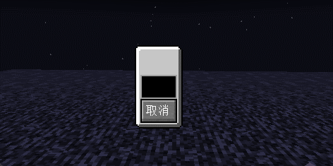

# Minecraft Flex UI

# 介绍
基于 `facebook` 开源的 `Yoga` 布局引擎实现了基于 `Flex` 布局的 `Minecraft` GUI框架。

在 `Yoga` 的基础上实现了 `Flex` 标准的子集的同时也一并实现了多数的 `CSS` 属性。

采用 `MVC` 的设计理念，实现了数据的单向与双向绑定。

开发者可在此之上设计与实现复杂的UI界面，并且本项目可作为 `Yoga` 引擎嵌入到游戏中作为游戏布局引擎的不完全参考实现。

# 示例



```java
public class WidgetTestScreen extends WidgetScreen {
	protected StringBuilderObservable text = new StringBuilderObservable();

	public WidgetTestScreen() {
		super(Text.of("test"));
	}

	@Override
	public void widget(ScreenWidget root) {
		root.flexDirection.put(WidgetFlexDirection.Row)
				.justifyContent.put(WidgetJustify.Center)
				.alignItems.put(WidgetAlign.Center)
				.child(new BoxWidget()
						.background.put(RectDrawable.LIGHT_PANEL)
						.child(new LabelWidget()
								.text.binding(text.asString().computed(Text::of))
								.margin(WidgetEdge.All, 4))
						.child(new TextBoxWidget()
								.text.binding(text))
						.child(new ButtonWidget()
								.click.on((mouse) -> close())
								.child(new LabelWidget()
										.text.put(Text.of("取消"))))
				);
	}
}

```

# 数据绑定
默认所有来自非计算绑定源的所有绑定都是双向绑定。
> 对计算绑定源设置值会被忽略
